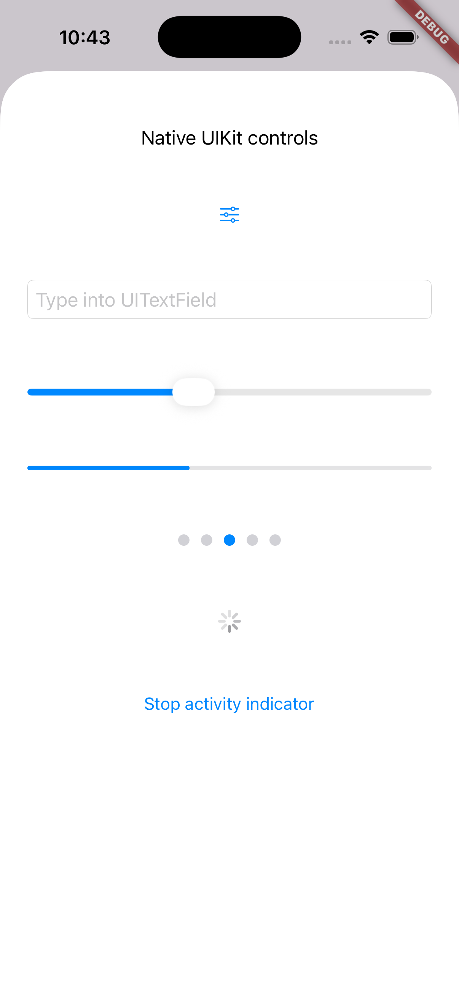

# uikit_bindings

This plugin allows you to use native UIKit components in your Flutter app using FFI.

Bindings are generated from UIKit Headers using ffigen.


This is experimental plugin and currently only limited number of components are supported.

## Available UIKit Components



The following table shows the UIKit components that are available through the bindings:

| Component                         | Status       |
| --------------------------------- | ------------ |
| `NSLayoutAttribute`               | ✅ Available |
| `NSLayoutConstraint`              | ✅ Available |
| `NSTextAlignment`                 | ✅ Available |
| `UIAction`                        | ✅ Available |
| `UIActivityIndicatorView`         | ✅ Available |
| `UIAlertController`               | ✅ Available |
| `UIApplication`                   | ✅ Available |
| `UIBarButtonItem`                 | ✅ Available |
| `UIBezierPath`                    | ⚠️ WIP       |
| `UIButton`                        | ✅ Available |
| `UIColor`                         | ✅ Available |
| `UICommand`                       | ⚠️ WIP       |
| `UIContextMenuConfiguration`      | ⚠️ WIP       |
| `UIContextMenuInteraction`        | ⚠️ WIP       |
| `UIEvent`                         | ⚠️ WIP       |
| `UIFocusAnimationCoordinator`     | ⚠️ WIP       |
| `UIFocusEffect`                   | ⚠️ WIP       |
| `UIFocusMovementHint`             | ⚠️ WIP       |
| `UIFocusUpdateContext`            | ⚠️ WIP       |
| `UIFont`                          | ✅ Available |
| `UIFontDescriptor`                | ⚠️ WIP       |
| `UIGestureRecognizer`             | ⚠️ WIP       |
| `UIImage`                         | ⚠️ WIP       |
| `UIImageView`                     | ✅ Available |
| `UIInputViewController`           | ⚠️ WIP       |
| `UIKeyboardLayoutGuide`           | ⚠️ WIP       |
| `UIKeyCommand`                    | ⚠️ WIP       |
| `UILabel`                         | ✅ Available |
| `UILayoutGuide`                   | ⚠️ WIP       |
| `UILocalNotification`             | ⚠️ WIP       |
| `UIMenu`                          | ⚠️ WIP       |
| `UIMenuElement`                   | ⚠️ WIP       |
| `UINavigationBar`                 | ⚠️ WIP       |
| `UINavigationController`          | ✅ Available |
| `UINavigationItem`                | ✅ Available |
| `UIPanGestureRecognizer`          | ⚠️ WIP       |
| `UIPageControl`                   | ✅ Available |
| `UIPinchGestureRecognizer`        | ⚠️ WIP       |
| `UIPopoverPresentationController` | ⚠️ WIP       |
| `UIPresentationController`        | ⚠️ WIP       |
| `UIProgressView`                  | ✅ Available |
| `UIPressesEvent`                  | ⚠️ WIP       |
| `UIRefreshControl`                | ⚠️ WIP       |
| `UIScene`                         | ✅ Available |
| `UIScrollView`                    | ⚠️ WIP       |
| `UISearchController`              | ⚠️ WIP       |
| `UISearchDisplayController`       | ⚠️ WIP       |
| `UISheetPresentationController`   | ⚠️ WIP       |
| `UISlider`                        | ✅ Available |
| `UIStackView`                     | ✅ Available |
| `UIStoryboard`                    | ⚠️ WIP       |
| `UIStoryboardSegue`               | ⚠️ WIP       |
| `UISwitch`                        | ⚠️ WIP       |
| `UITapGestureRecognizer`          | ⚠️ WIP       |
| `UITextField`                     | ✅ Available |
| `UITextInputAssistantItem`        | ⚠️ WIP       |
| `UITextInputMode`                 | ⚠️ WIP       |
| `UIToolbar`                       | ⚠️ WIP       |
| `UITouch`                         | ⚠️ WIP       |
| `UIUserNotificationSettings`      | ⚠️ WIP       |
| `UIView`                          | ✅ Available |
| `UIViewController`                | ✅ Available |
| `UIViewGeometry`                  | ✅ Available |
| `UIWindow`                        | ⚠️ WIP       |
| `UIWindowScene`                   | ✅ Available |

### Legend

- ✅ **Available**: Fully functional with examples
- ⚠️ **Binding only**: Binding exists but not tested/used in examples
- ⚠️ **No constructor**: Known issue where default constructor is not available\*

### Helper Functions

The library also provides several helper functions and extensions:

| Function/Extension                | Description                        |
| --------------------------------- | ---------------------------------- |
| `UIKitColorExtension.toUIColor()` | Convert Flutter Color to UIColor   |
| `createCGRect()`                  | Helper to create CGRect structures |
| `createCGSize()`                  | Helper to create CGSize structures |
| `getKeyWindow()`                  | Find the key window for the active scene |

## Regenerating bindings

This project uses Dart-API to use ffigen. To regenerate the bindings, run:

```bash
dart run tool/ffigen.dart
```

`UIAction`-based control callbacks require iOS 14 or later.
